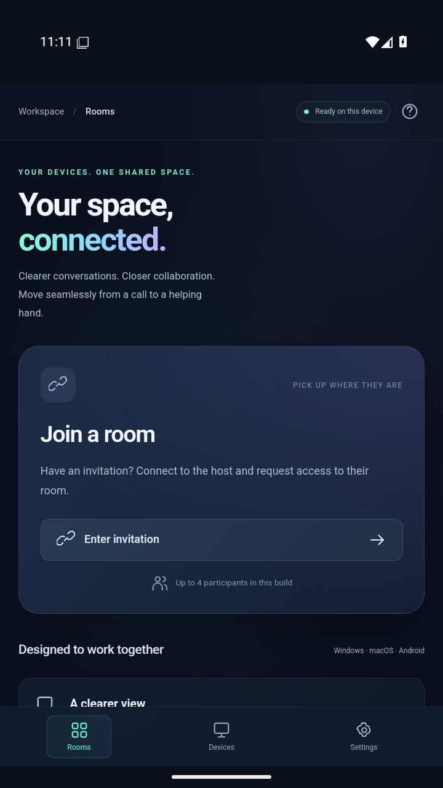
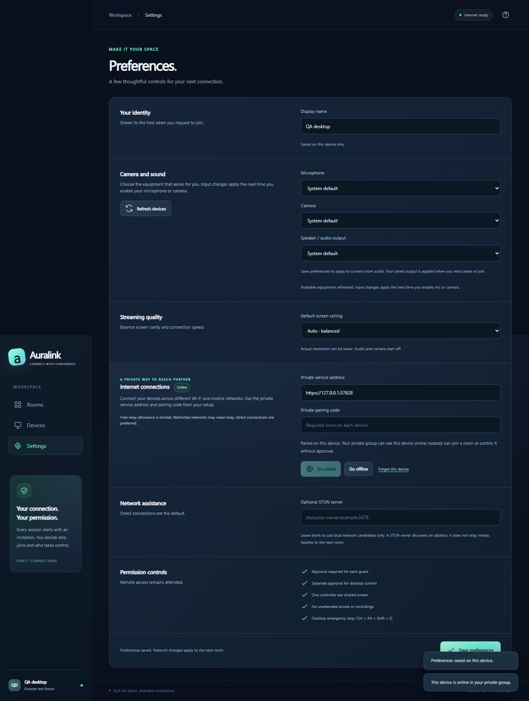
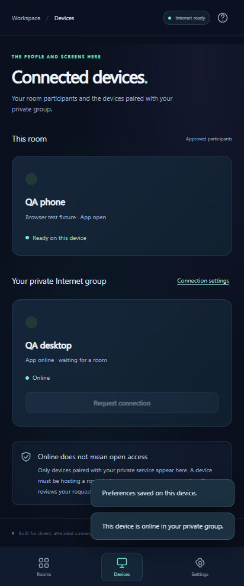

<div align="center">


[](https://github.com/EhosanurRahmanRomi/auralink/actions/workflows/ci.yml)
[](https://github.com/EhosanurRahmanRomi/auralink/releases/latest)
[](LICENSE)

**Calls, presentations and remote assistance across your devices.**

[](https://github.com/EhosanurRahmanRomi/auralink/releases/download/v0.3.0/Auralink-Setup-0.3.0-Windows-x64.exe)
[](https://github.com/EhosanurRahmanRomi/auralink/releases/download/v0.3.0/Auralink-0.3.0-Android.apk)
[](https://github.com/EhosanurRahmanRomi/auralink/releases/download/v0.3.0/Auralink-0.3.0-Mac-arm64.dmg)

[Latest release](https://github.com/EhosanurRahmanRomi/auralink/releases/latest) · [Gallery](#gallery) · [Testing guide](docs/TESTING.md) · [Architecture](docs/ARCHITECTURE.md) · [Report an issue](https://github.com/EhosanurRahmanRomi/auralink/issues/new/choose)

</div>

Auralink connects Windows, Apple Silicon Macs and Android phones through **Nearby** rooms or a private **Internet** group. Pair your trusted devices, see who is online, and request a connection. The room owner approves every participant; each device chooses when to enable its microphone, camera or screen. Remote input requires another approval from the screen owner.

**Experimental private Internet beta.** Check [validation and limits](VALIDATION.md) before relying on it. Internet coordination can use a free Cloudflare account and its supplied `workers.dev` address. Media attempts direct WebRTC; optional TURN fallback has finite provider allowances. Messaging, file sharing and recording are outside this app.

## Download Auralink 0.3.0

| Your device | Installer |
|---|---|
| Windows 11 / 64-bit Windows | [Download Windows Setup (.exe)](https://github.com/EhosanurRahmanRomi/auralink/releases/download/v0.3.0/Auralink-Setup-0.3.0-Windows-x64.exe) |
| Android 10+ / iQOO | [Download Android app (.apk)](https://github.com/EhosanurRahmanRomi/auralink/releases/download/v0.3.0/Auralink-0.3.0-Android.apk) |
| Apple Silicon / MacBook Air M4, macOS 13+ | [Download Mac app (.dmg)](https://github.com/EhosanurRahmanRomi/auralink/releases/download/v0.3.0/Auralink-0.3.0-Mac-arm64.dmg) |

[Quick start](https://github.com/EhosanurRahmanRomi/auralink/releases/download/v0.3.0/START-HERE.md) · [Checksums](https://github.com/EhosanurRahmanRomi/auralink/releases/download/v0.3.0/SHA256SUMS.txt) · [Verification report](https://github.com/EhosanurRahmanRomi/auralink/releases/download/v0.3.0/RELEASE-VERIFICATION.json) · [Source archive](https://github.com/EhosanurRahmanRomi/auralink/releases/download/v0.3.0/Auralink-0.3.0-source.zip)

Open [the release page](https://github.com/EhosanurRahmanRomi/auralink/releases/latest) to find all seven files under **Assets**. Install instructions and device checks are below.

## Gallery

<table>
<tr><th>Desktop workspace</th><th>Android companion</th></tr>
<tr>
<td></td>
<td></td>
</tr>
</table>

<table>
<tr><th>Internet preferences</th><th>Private device presence</th></tr>
<tr>
<td></td>
<td></td>
</tr>
</table>

Internet screenshots show the local browser test fixture. Native Android runtime and physical-device results are documented separately in [validation](VALIDATION.md).

## Features

- Audio and camera calls for up to four participants.
- Private device pairing, online/offline status and host-approved connection requests across networks.
- Desktop screen/window presentation with adaptive quality and connection diagnostics.
- Android display sharing through native system capture consent.
- Attended desktop pointer, keyboard and scrolling; Android gestures and supported editable text through an explicitly enabled accessibility service.
- Equipment selection, microphone levels and speaker checks.
- Separate control approval, immediate local stop and 15-minute control expiry.

## Download and connect

Use the platform download above, or open [the latest release](https://github.com/EhosanurRahmanRomi/auralink/releases/latest). These are testing builds: Windows is unsigned, macOS is ad-hoc signed and not notarized, and Android uses the project's private development key. Review the publisher and SHA-256 checksums before installing.

Each release includes `SHA256SUMS.txt`, a source archive and `RELEASE-VERIFICATION.json` describing the exact package hashes, build commit and completed checks. Hardware testing remains separate from browser, emulator and packaged-launch checks.

1. Choose **Nearby** for a same-Wi-Fi test, or configure **Settings → Internet connections** with your private service address and pairing code on each device. [Deploy your own free coordinator](internet-service/README.md); no purchased domain is required.
2. Create a room in the chosen mode. Nearby hosts select their reachable Wi-Fi/Ethernet address. Internet hosts remain online and may share an invitation privately.
3. Request a connection from **Devices** or paste the invitation into **Join room**. The host approves admission before any call or screen capture starts.
4. Enable microphone/camera deliberately. Select equipment in Settings and use the room's **Check sound** tests if needed. Headphones help when devices are nearby.
5. Choose **Share screen** on the presenting device. Android displays the system capture prompt.
6. Select the shared device and request control. The owner reviews and confirms native permission. Android also needs Auralink Accessibility enabled through system settings.
7. Stop with the visible room controls or Android sharing notification. Desktop emergency stop: **Ctrl+Alt+Shift+Q** (Windows) / **Command+Option+Shift+Q** (Mac).

Enabling Android Accessibility alone grants nobody control. Input still requires an approved session and active phone share. Android capture requests the full phone display so control coordinates map to the shared screen. On macOS 15+, allow Auralink's Local Network permission for nearby connections. Grant Camera, Microphone, Screen Recording and Accessibility only for the associated feature; restart after permission changes if required. Use the OS review/open flow for the unnotarized DMG, rather than disabling Gatekeeper globally.

## Capabilities and limits

| Feature | Windows | macOS Apple Silicon | Android |
|---|---|---|---|
| Host room | Nearby / Internet | Nearby / Internet | Internet; joins Nearby rooms |
| Audio/camera | WebRTC | WebRTC | WebView WebRTC + native audio route |
| Present screen | Screen/window | Screen/window with OS permission | MediaProjection → video frames → WebRTC |
| View / request control | Yes | Yes | Yes |
| Accept input | Normal desktop native helper | Normal desktop, Accessibility | Gestures/navigation/supported text fields, Accessibility |
| Separate approval / local stop | Yes | Yes | Yes |

Desktop sharing targets up to **1440p/30 fps**; camera calls up to **1080p/30 fps**. Initial Android sharing converts bounded native JPEGs into generated video frames, up to 1280 or 1920 pixels on the longest edge at about 12 fps. Update Android System WebView if prompted. It is not a 2K/30 native Android encoder. Actual quality can be lower; diagnostics show received resolution, fps, codec and route.

Voice uses the microphone; shared system audio is not included. Text input currently targets English US ASCII. Arbitrary Unicode/IME, every OS shortcut, Windows UAC, locked screens, protected Android surfaces and system permission dialogs are outside current control support. See [device tests](docs/TESTING.md).

Rooms have a live owner; closing that owner ends the room. Internet presence belongs to your private paired group, with at most 32 devices and four approved participants per room. It is not a public directory. Coordination uses Cloudflare infrastructure, so the app is not fully decentralized. STUN helps find direct paths; some routers and mobile carriers require the optional TURN relay. Relay is disabled in the default configuration until the owner's free quota and expiring credentials are verified. Cross-network connectivity and unlimited free streaming are not guaranteed.

## Build locally

Use Node.js 24, npm and Git. All source and outputs stay on your computer.

```sh
npm ci
npm start
```

If dependency install scripts are suppressed, run `node node_modules/electron/install.js` after installation.

```sh
# Windows per-user installer
npm run dist:win:setup -- --publish never

# Apple Silicon Mac, with Xcode command-line tools
npm run dist:mac -- --publish never
```

Android needs JDK 21, SDK platform 36 and build-tools 36.0.0:

```powershell
pwsh -NoProfile -File scripts/build-android.ps1 -AndroidSdkRoot YOUR_SDK_PATH -JdkDirectory YOUR_JDK_PATH
pwsh -NoProfile -File scripts/verify-android.ps1 -AndroidSdkRoot YOUR_SDK_PATH -JdkDirectory YOUR_JDK_PATH
```

See [Android build details](android/README.md). Outputs go to `release/`. Never upload `.private/`: it contains the stable APK signing identity. CI generates a temporary key, so its APK cannot update a stable-key local/release installation.

## Architecture and verification

The locally bundled interface runs in an isolated Electron renderer or locked-down Android WebView. Nearby clients pin invitation certificates; Internet uses normal certificate-chain and hostname verification. Both coordinators enforce admission before signaling. Scoped input requires a peer/session, active capture, increasing sequence, bounded rate, expiry and revocation. Internet connection loss stops sharing and control; reconnect restores the directory without reopening a room. See [architecture](docs/ARCHITECTURE.md).

```sh
npm test
npm run check
npm ci --prefix internet-service
node tests/rtc-browser.cjs
node tests/ui-browser.cjs
node tests/mobile-control.cjs
node tests/android-security.cjs
node tests/internet-browser.cjs
npm run test:runtime --prefix internet-service
```

Tests exercise real WebRTC with synthetic media, broker admission, native-input policy, certificate-pinned Java WSS and packaged source parity. Synthetic tests do not prove physical microphone/camera/phone or internet performance. [VALIDATION.md](VALIDATION.md) records actual checks. No absolute-security or "virus-free" claim is made.

## Contribute

Read [CONTRIBUTING.md](CONTRIBUTING.md), [SECURITY.md](SECURITY.md) and [the roadmap](docs/ROADMAP.md). Hardware audio tests, native Android encoding, connectivity and accessibility improvements are welcome.

Created by **[Ehosanur Rahman Romi](https://github.com/EhosanurRahmanRomi)**. Original code is [MIT licensed](LICENSE); bundled third-party notices are in `android/legal/`.
