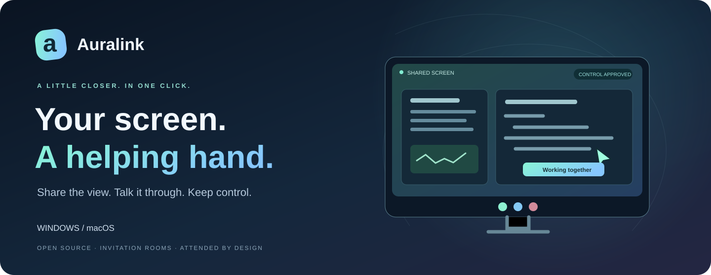
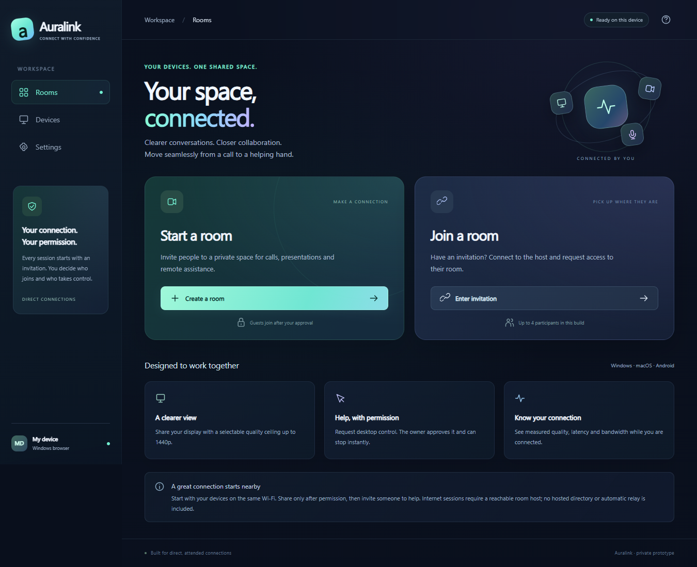
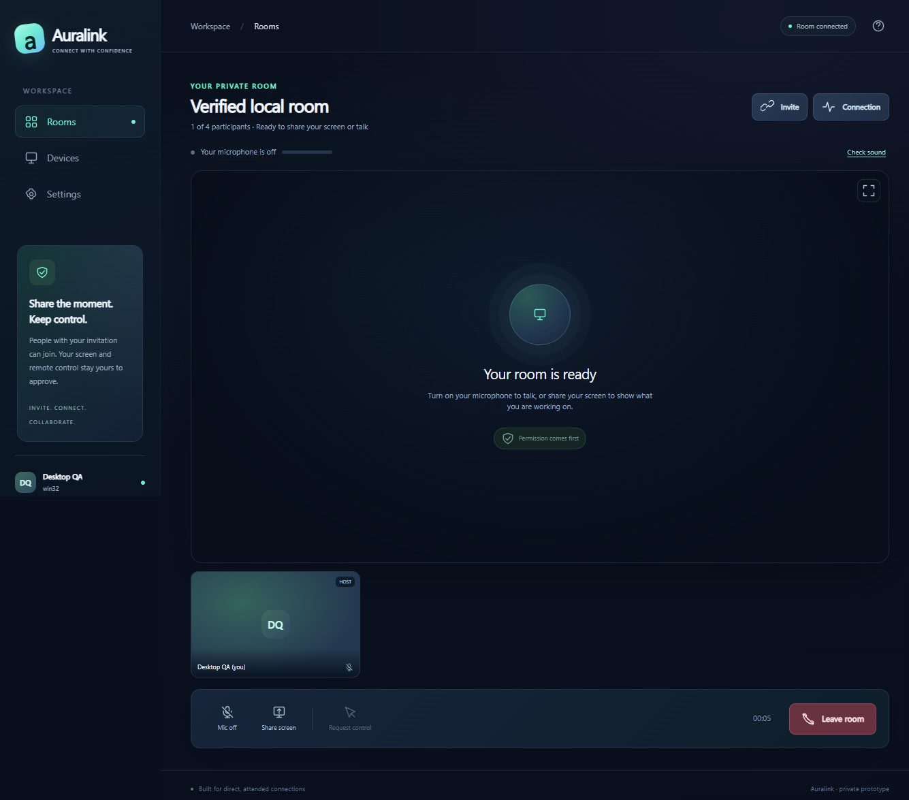

<div align="center">



[](https://github.com/EhosanurRahmanRomi/auralink/actions/workflows/ci.yml)
[](https://github.com/EhosanurRahmanRomi/auralink/releases/latest)
[](LICENSE)

**Share your screen. Talk it through. Help with permission.**

[Download test builds](https://github.com/EhosanurRahmanRomi/auralink/releases/latest) · [Gallery](#gallery) · [Device tests](docs/TESTING.md) · [Architecture](docs/ARCHITECTURE.md) · [Report an issue](https://github.com/EhosanurRahmanRomi/auralink/issues/new/choose)

</div>

Auralink is an open-source screen-sharing and attended remote-control app. The current milestone focuses on **Windows 11 and Apple Silicon macOS**, with optional microphone audio. Camera calls, messaging, files and recording are outside the current scope. Android development is retained for later delivery.

The room flow is **Open a room → copy its invitation → join from the other device**. Invitation holders enter automatically while invitations are open. Screen capture and remote control remain separate, deliberate actions.

**0.4.1 repairs screen and microphone recovery.** Check the version and completed checks on [the published release page](https://github.com/EhosanurRahmanRomi/auralink/releases/latest). Both desktops must use the matching build. [Validation](VALIDATION.md) distinguishes synthetic, packaged and physical-device evidence.

## Download and connect

Expand **Assets** on the release page and choose a matching version:

| Device | Package |
|---|---|
| Windows 11 / x64 | Auralink-Setup-VERSION-Windows-x64.exe |
| MacBook Air M4 / Apple Silicon, macOS 13+ | Auralink-VERSION-Mac-arm64.dmg |

Releases include checksums, source and a report describing the exact build and completed checks. Windows test installers are unsigned; Mac test builds are ad-hoc signed and unnotarized. Android delivery is deferred from this desktop milestone.

1. Launch Auralink and click **Open a room**. Its built-in coordinator supplies the address; guests need no domain, account or pairing form.
2. Share **Copy link** or **Copy code** privately. Open the link in Auralink or paste it into **Join room**. Native links depend on the installed package's protocol registration.
3. Select **Share screen** and choose a display/window. Microphone audio is optional and starts off; use **Check sound** before enabling it.
4. For remote help, view the other person's full-display share and **Request control**. The screen owner separately approves it. macOS also requires Accessibility permission.
5. Stop with **Stop control**, **Stop sharing** or **Leave room**. Emergency stop: **Ctrl+Alt+Shift+Q** on Windows; **Command+Option+Shift+Q** on Mac.

If a participant joins but screen or audio does not arrive, open **Connection → Retry through secure relay**. This reconnects the existing capture using the free fallback; control must be approved again. **Check sound** verifies your local microphone and speaker, while Connection details show actual packet counts and processing state. Use **Enable sound** when audio processing is paused after a native permission prompt.

Hosts can remove participants, lock invitations and create new invitations. **Remove & close invite** removes that connection and invalidates the old code. A fresh anonymous app cannot be permanently identified as the same person; share new invitations only with people you trust.

For a same-Wi-Fi test without hosted coordination, use **Other connection options → Nearby / private room → Nearby**. Nearby retains host admission approval. Advanced private groups remain available for separately configured services.

## Gallery

| One-click workspace | Screen-sharing room |
|---|---|
|  |  |

These captures show the bundled interface. Validation identifies actual-app and browser-fixture evidence separately.

## Features and limits

- Screen/window presentation with selectable ceilings up to **2560×1440**, fullscreen and live resolution/frame-rate/codec/route measurements.
- Optional microphone voice, input/output selection, levels, speaker tests and playback unlocking.
- Attended pointer, scrolling and supported desktop keyboard input, with one controller per shared full display.
- Invitation rooms for up to four people, host removal, invitation closure/rotation and separate control consent.
- Direct encrypted WebRTC plus bounded encrypted WebSocket fallback when enabled by the service.

Two actual Electron apps on one Windows PC exchanged a **2560×1440 H.264 screen above 15 measured fps**, one presenter at a time in both directions, through the deployed relay with direct RTC deliberately blocked. The same test decoded microphone tones in both directions and after microphone restart. The release report records each measured result. These synthetic tests do not establish physical Mac capture/control or a different-network result. **1440p/30 fps remains a ceiling, not a guarantee**; hardware, codecs, bandwidth and motion affect quality. Basic JPEG fallback is a limited compatibility mode. See [validation](VALIDATION.md).

Different networks can block direct media while both apps appear online. Coordination makes rooms reachable; relay supplies an alternate media path. The default service stays on Cloudflare Workers Free, with finite room, byte and message budgets and no active Metered integration. A separate Cloudflare Realtime TURN adapter remains disabled until actual account controls are verified: its advertised 1,000 GB allowance does not automatically prevent overage charges. See [service setup](internet-service/README.md).

The coordinator distributes relay keys, so encrypted WebSocket transport assumes a trusted coordinator. Microphone audio does not include system playback. ASCII/host keyboard-layout limits apply. Arbitrary Unicode/IME, Windows UAC/secure desktops, locked screens and protected OS surfaces remain outside control support.

macOS requires **Microphone**, **Screen Recording** and **Accessibility** only for enabled features. macOS 15+ may request **Local Network** for Nearby. Restart after permission changes when required; use the OS app review/open flow for an unnotarized build. Physical MacBook screen/audio/input checks remain essential.

## Build locally

Use Node.js 24, npm and Git. Source and outputs stay on your computer.

```sh
npm ci
npm start
npm run dist:win:setup -- --publish never
# On Apple Silicon macOS with Xcode command-line tools:
npm run dist:mac -- --publish never
```

If install scripts are suppressed, run `node node_modules/electron/install.js`. Outputs go to `release/`. Deferred Android instructions remain in [android/README.md](android/README.md). Never upload `.private/`, credentials, invitations or signing keys.

## Verification and contribution

```sh
npm test
npm run check
npm ci --prefix internet-service
npm run test:runtime --prefix internet-service
node tests/invitation-browser.cjs
node tests/websocket-relay-browser.cjs
node tests/audio-browser.cjs
npm run test:desktop
```

Browser checks use real engines with synthetic screen/microphone sources. Forced fallback prevents direct RTC and measures decoded media; it does not establish every carrier, country, physical speaker or macOS permission combination. Use [device tests](docs/TESTING.md) for Windows↔Mac on genuinely different networks and [validation](VALIDATION.md) for completed checks.

Read [CONTRIBUTING.md](CONTRIBUTING.md), [SECURITY.md](SECURITY.md) and [the roadmap](docs/ROADMAP.md). Created by **[Ehosanur Rahman Romi](https://github.com/EhosanurRahmanRomi)**. Original code is [MIT licensed](LICENSE).
