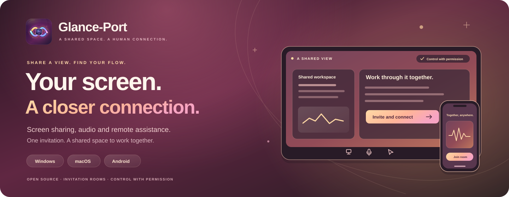
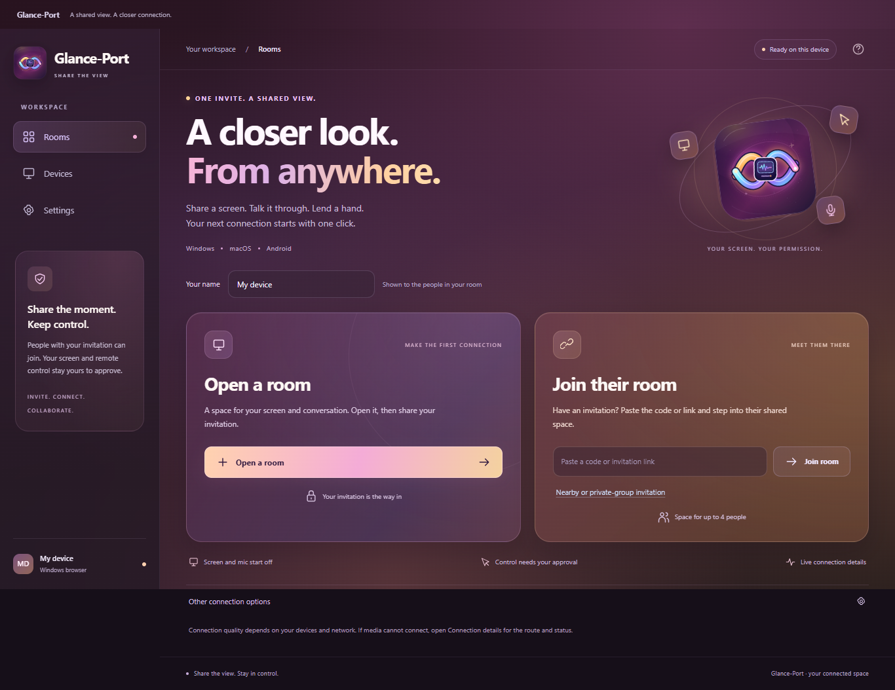
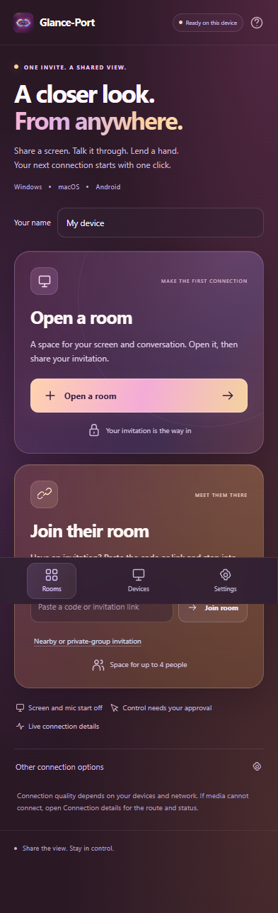

<div align="center">



# Glance-Port

[](https://github.com/EhosanurRahmanRomi/glance-port/actions/workflows/ci.yml)
[](https://github.com/EhosanurRahmanRomi/glance-port/releases/latest)
[](LICENSE)

**Share your screen. Talk it through. Help with permission.**

[Download test builds](https://github.com/EhosanurRahmanRomi/glance-port/releases/latest) · [Gallery](#gallery) · [Device tests](docs/TESTING.md) · [Architecture](docs/ARCHITECTURE.md) · [Report an issue](https://github.com/EhosanurRahmanRomi/glance-port/issues/new/choose)

</div>

Glance-Port is an open-source screen-sharing and attended remote-control app for **Windows 11, Apple Silicon macOS and Android 10+**, with independently switchable microphone and device audio. Camera calls, messaging, files and recording are outside the current scope.

The room flow is **Open a room → copy its invitation → join from the other device**. Invitation holders enter automatically while invitations are open. Screen capture and remote control remain separate, deliberate actions.

**0.6.0 adds stereo device audio, cursor zoom and phone pinch, smaller fullscreen controls, and Android session retention across Activity recreation.** Check the version and completed checks on [the published release page](https://github.com/EhosanurRahmanRomi/glance-port/releases/latest). All devices must use the matching build. [Validation](VALIDATION.md) distinguishes synthetic, packaged and physical-device evidence.

## Download and connect

Download **Glance-Port 0.6.0** for your device below. Use the same version on every device.

| Device | Download installer |
|---|---|
| Windows 11 / x64 | [Download for Windows (.exe)](https://github.com/EhosanurRahmanRomi/glance-port/releases/download/v0.6.0/Glance-Port-Setup-0.6.0-Windows-x64.exe) |
| MacBook Air M4 / Apple Silicon, macOS 13+ | [Download for Mac (.dmg)](https://github.com/EhosanurRahmanRomi/glance-port/releases/download/v0.6.0/Glance-Port-0.6.0-Mac-arm64.dmg) |
| Android 10+, including iQOO | [Download for Android (.apk)](https://github.com/EhosanurRahmanRomi/glance-port/releases/download/v0.6.0/Glance-Port-0.6.0-Android.apk) |

[Installation guide](https://github.com/EhosanurRahmanRomi/glance-port/releases/download/v0.6.0/START-HERE.md) · [Source ZIP](https://github.com/EhosanurRahmanRomi/glance-port/releases/download/v0.6.0/Glance-Port-0.6.0-source.zip) · [Checksums](https://github.com/EhosanurRahmanRomi/glance-port/releases/download/v0.6.0/SHA256SUMS.txt) · [Verification report](https://github.com/EhosanurRahmanRomi/glance-port/releases/download/v0.6.0/RELEASE-VERIFICATION.json) · [All releases](https://github.com/EhosanurRahmanRomi/glance-port/releases)

Releases include checksums, source and a report describing the exact build and completed checks. Windows test installers are unsigned; Mac test builds are ad-hoc signed and unnotarized. Android uses the project's stable local development signing identity.

Glance-Port was previously named Auralink. The internal app IDs, `auralink://` invitation links and existing Auralink profile directories remain compatible. The local Android signing key is retained for updates; do not delete its private key. A separately generated CI test APK may have a different signing identity.

1. Launch Glance-Port and click **Open a room**. Its built-in coordinator supplies the address; guests need no domain, account or pairing form.
2. Share **Copy link** or **Copy code** privately. Open the link in Glance-Port or paste it into **Join room**. Native links depend on the installed package's protocol registration.
3. Select **Share screen** and choose a display/window. Microphone and **Device audio** start off and switch independently. Enable Device audio while sharing to send permitted playback from that device; use **Check sound** for the microphone.
4. For remote help, view the other person's full-display share and **Request control**. The screen owner separately approves it. macOS requires Accessibility permission; Android requires its separately enabled attended Accessibility service and native owner confirmation.
5. Stop with **Stop control**, **Stop sharing** or **Leave room**. Emergency stop: **Ctrl+Alt+Shift+Q** on Windows; **Command+Option+Shift+Q** on Mac.

If a participant joins but screen or audio does not arrive, open **Connection → Retry through secure relay**. This reconnects the existing capture using the free fallback; control must be approved again. **Check sound** verifies your local microphone and speaker, while Connection details show actual packet counts and processing state. Use **Enable sound** when audio processing is paused after a native permission prompt.

Use **Full screen** while watching a shared screen. The compact **− / percentage / + / Fit** tools zoom from 100–400%; drag to pan while viewing. Mouse wheel zooms around the cursor; while controlling, hold Ctrl/Command to zoom and keep ordinary wheel scrolling on the remote device. Phone pinch zooms without sending remote taps; enable **Touch drag** explicitly for approved single-finger remote dragging. Fit restores the whole screen. The presentation fills the available viewport and keeps call, sharing and control-stop actions reachable. Exit with the onscreen button or Escape on desktop; leaving the room also exits. If browser fullscreen is unavailable or refused, the app uses an in-page presentation mode. Desktop titlebar controls remain native, with a transparent titlebar over the app's gradient; the main window stays opaque.

Minimizing the desktop app retains the existing room and capture. Renderer background throttling is disabled, and an active session requests prevention of app suspension until the room ends. Closing the app, suspending the computer, disconnecting its network or locking a protected screen can still interrupt media or control.

On Android, approve the system screen-sharing dialog and notification permission for visible Stop/End actions. Ordinary Home/return and Activity recreation retain the same room, WebView and projection. A visible session service renews bounded partial wake-lock leases only while that room remains active. A healthy host has no fixed inactivity/session timer; leaving or losing the host connection ends the room for everyone. This does not keep the display on or guarantee survival of manufacturer battery restrictions, process reclamation or screen-lock capture rules. Phone capture uses a selectable maximum 1280/1920-pixel long edge at up to 12 fps, rather than the desktop 1440p ceiling. A recent Android System WebView is required. Read the [Android guide](android/README.md) for capture, consent and battery/device boundaries.

Hosts can remove participants, lock invitations and create new invitations. **Remove & close invite** removes that connection and invalidates the old code. A fresh anonymous app cannot be permanently identified as the same person; share new invitations only with people you trust.

For a same-Wi-Fi test without hosted coordination, use **Other connection options → Nearby / private room → Nearby**. Nearby retains host admission approval. Advanced private groups remain available for separately configured services.

## Gallery

| Desktop workspace | Android layout |
|---|---|
|  |  |

Glance-Port 0.6.0 uses warm plum, rose, coral and gold gradients with the supplied logo. These gallery captures show the actual renderer at desktop and phone viewport sizes in a browser; the release report distinguishes native-app and emulator checks.

## Features and limits

- Screen/window presentation with selectable ceilings up to **2560×1440**, a compact fullscreen **Stream** selector for live outgoing quality changes, and actual resolution/frame-rate/codec/route measurements. Android updates its existing capture up to a 1920-pixel long edge; viewers keep their own local zoom controls.
- Independently switchable microphone and device audio, a 48 kHz stereo mix, 192 kbps Opus encrypted fallback, levels, speaker tests and playback unlocking.
- Attended pointer, scrolling and supported desktop keyboard input, with one controller per shared full display.
- Invitation rooms for up to four people, host removal, invitation closure/rotation and separate control consent.
- Direct encrypted WebRTC plus bounded encrypted WebSocket fallback when enabled by the service.

Two actual Electron apps on one Windows PC exchanged a **2560×1440 H.264 screen above 15 measured fps**, one presenter at a time in both directions, through the deployed relay with direct RTC deliberately blocked. The same test decoded microphone tones in both directions and after microphone restart. The release report records each measured result. These synthetic tests do not establish physical Mac capture/control or a different-network result. **1440p/30 fps remains a ceiling, not a guarantee**; hardware, codecs, bandwidth and motion affect quality. Basic JPEG fallback is a limited compatibility mode. See [validation](VALIDATION.md).

Different networks can block direct media while both apps appear online. Coordination makes rooms reachable; relay supplies an alternate media path. The default service stays on Cloudflare Workers Free, with finite room, byte and message budgets and no active Metered integration. A separate Cloudflare Realtime TURN adapter remains disabled until actual account controls are verified: its advertised 1,000 GB allowance does not automatically prevent overage charges. See [service setup](internet-service/README.md).

The coordinator distributes relay keys, so encrypted WebSocket transport assumes a trusted coordinator. Device audio captures eligible playback only while the owner shares and enables it. Android source apps may prohibit capture; protected content and call audio are excluded. Desktop loopback depends on OS capture permissions and support. Incoming room audio is excluded from the local mix. ASCII/host keyboard-layout limits apply. Arbitrary Unicode/IME, Windows UAC/secure desktops, locked screens and protected OS surfaces remain outside control support.

macOS requires **Microphone**, **Screen Recording / System Audio Recording** and **Accessibility** only for enabled features. macOS 15+ may request **Local Network** for Nearby. Restart after permission changes when required; use the OS app review/open flow for an unnotarized build. Physical MacBook screen/audio/input checks remain essential.

## Build locally

Use Node.js 24, npm and Git. Source and outputs stay on your computer.

```sh
git clone https://github.com/EhosanurRahmanRomi/glance-port.git
cd glance-port
npm ci
npm start
npm run dist:win:setup -- --publish never
# On Apple Silicon macOS with Xcode command-line tools:
npm run dist:mac -- --publish never
```

If install scripts are suppressed, run `node node_modules/electron/install.js`. Outputs go to `release/`. The Android build uses `scripts/build-android.ps1` with Java 21, Android SDK platform 36 and build tools 36.0.0; see [CI setup](.github/CI-NOTES.md) and [Android use](android/README.md). `scripts/make-icon.ps1` converts the supplied canonical PNG into a Windows ICO without replacing the PNG. Never upload `.private/`, credentials, invitations or signing keys.

## Verification and contribution

```sh
npm test
npm run check
npm ci --prefix internet-service
npm run test:runtime --prefix internet-service
node tests/invitation-browser.cjs
node tests/websocket-relay-browser.cjs
node tests/audio-browser.cjs
node tests/system-audio-browser.cjs
node tests/fullscreen-browser.cjs
npm run test:desktop
```

Browser checks use real engines with synthetic screen/microphone sources. Forced fallback prevents direct RTC and measures decoded media; it does not establish every carrier, country, physical speaker or macOS permission combination. Use [device tests](docs/TESTING.md) for Windows↔Mac on genuinely different networks and [validation](VALIDATION.md) for completed checks.

Read [CONTRIBUTING.md](CONTRIBUTING.md), [SECURITY.md](SECURITY.md) and [the roadmap](docs/ROADMAP.md). Created by **[Ehosanur Rahman Romi](https://github.com/EhosanurRahmanRomi)**. Original code is [MIT licensed](LICENSE).
