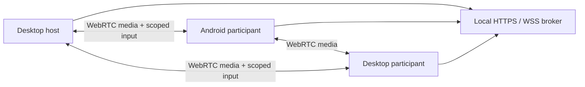
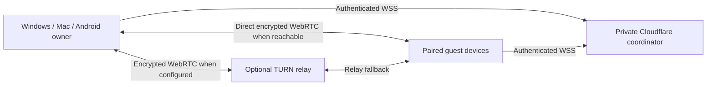

# Architecture

The 0.3 private Internet beta adds an optional hosted coordinator alongside the existing **Nearby** mode. Both modes use a four-person WebRTC mesh, host-approved admission and a separate screen-owner control permission. Media and input data do not pass through either signaling coordinator.

## Nearby mode

One Windows or Mac desktop hosts a temporary HTTPS/WSS coordinator with an ephemeral certificate, room key and independent loopback-only host token. Invitation fragments carry the room key and certificate fingerprint. Native clients check the pin before admission. The broker assigns live peer IDs and permits signaling only after owner approval. This mode needs no hosted account and is intended for reachable devices, usually on the same private network. A private Wi-Fi address is not an internet address.

## Private Internet mode

The optional service in [internet-service](../internet-service/README.md) runs on **Cloudflare Workers Free with a SQLite Durable Object**. Cloudflare supplies a public `workers.dev` address and a normal CA-issued TLS certificate; no purchased domain is required. Internet transport verifies normal platform TLS. It does not use Nearby's self-signed certificate exception or certificate pin.

The owner provisions a private pairing key as a Worker secret. The first WebSocket message pairs a device or registers it with its own existing device token. Secrets are not URL query parameters. The service persists only hashes of device tokens, invitation keys and host tokens. A maximum of **32 paired devices** share this private directory; outsiders receive no device list. Offline registrations remain visible to paired devices. Forgetting a device removes its registration and invalidates its token.

Each paired device has one authenticated directory socket. A second valid connection replaces that device's previous socket and ends its room participation. The directory lists online state and available hosts while the app remains connected. It is not a public social network or a worldwide anonymous device search.

An authenticated owner creates a room and receives a room key plus a separate host token bound to its device identity. A guest selects an available paired device or pastes an invitation into Auralink. Both paths produce a pending request; only the room host may approve admission. Pending guests cannot signal, control another device or approve themselves. The four-person limit includes the owner. Server-generated peer IDs and authenticated room membership determine signal senders, recipients and roles.

Successful admission supplies ICE configuration before the client constructs its peer connections. Public STUN helps discover direct routes. **TURN is disabled by default.** Optional Metered configuration fetches an already-created, expiring credential using a server-held credential-scoped API key. Only the necessary ICE username/password reaches approved participants; the provider API key remains server-side. Provider failures and exhausted issuance allowances produce direct-only configuration rather than a paid fallback.

The default optional relay guards permit four credential fetch attempts per UTC day, 60 per UTC month and a ten-minute room lifetime when relay is offered. Counters and the room deadline persist in SQLite. The entire room ends at that deadline even if its selected route is direct. These guards limit application behavior; they do not measure provider bytes or guarantee a billing cap. The owner must verify provider-enforced free quotas, disabled overages and actual credential expiration before enabling TURN. See the service setup guide for exact configuration and current provider documentation.

SQLite holds small device records, room capability hashes and relay counters. Hibernatable WebSocket attachments restore approved membership; automatic `ping`/`pong` replies refresh idle leases without keeping JavaScript running. Alarms expire unregistered sockets, idle connections, admission requests, consent leases and relay rooms. The coordinator does not record calls, store screen/video frames or upload user files.

## Media and attended control

The four-person mesh uses perfect negotiation and distinct camera/presentation tracks. Bounded ordered data channels carry structured input. Electron checks IPC against its sandboxed bundled main frame; Windows uses SendInput and Mac a Swift/CoreGraphics helper. Grants scope a full display, peer and session and validate event types, sequence, rate and expiry. Revocation clears authorization before releasing keys.

Internet control remains independent from room admission. The actual screen owner approves a request and issues a new session ID, with the same separate native consent as Nearby mode. The coordinator's consent lease expires after **15 minutes** and binds owner/controller device IDs, live peer IDs, socket connection IDs and the room. Ordinary hibernation preserves a verified unexpired lease. An expired lease, replaced socket, changed room or missing participant revokes control; an unverified grant never silently resumes. A fresh connection or new admission cannot inherit a previous grant. The owner can revoke immediately. Host disconnect ends its room, and client transport loss tears down media and native input authorization.

## Android and platform boundaries

Android uses bundled WebView assets and native Java WSS: certificate-pinned for Nearby invitations, normal CA validation for a configured Internet service. A visible MediaProjection foreground service captures after system consent. One JPEG frame at a time becomes a `VideoFrame` written to `MediaStreamTrackGenerator`; acknowledgments bound work and memory. This avoids relying on canvas compositor paints while the Activity is hidden. Older WebViews receive update guidance before capture starts. Capture remains bounded to **12 fps**, with a maximum long edge of 1280 or 1920 pixels according to the selected preset. This is not a native 2K/30fps streaming encoder.

Accessibility maps approved events into gestures/navigation/editable text and cannot override secure surfaces. Phone input remains ASCII-focused and target-app dependent. Enabling Accessibility alone grants no remote access. Ordinary backgrounding stops the room; explicitly active projection permits continuation with local/system stop. Microphone audio is supported; Android system audio is not captured by the current screen-sharing path.

Preferences and credentials stay on the user's device. Nearby room state is transient; Internet directory registrations and bounded coordinator metadata persist in the owner's Cloudflare deployment. Windows installers remain unsigned and the Apple Silicon Mac app is ad-hoc signed and unnotarized. Secure OS surfaces, unrestricted phone control, larger groups and guaranteed high-resolution performance remain outside the current beta.

## Verification status

The coordinator's policy tests, real local workerd/SQLite/WebSocket tests and deployment dry run pass. Browser media and platform integration are being verified separately for 0.3. The public coordinator was deployed to the owner's Cloudflare account and passed native and browser normal-TLS pairing, admission and consent tests. Physical tests across different networks remain pending. Automated checks do not establish cross-country audio quality, hardware microphone output, full device control or unlimited free capacity.
