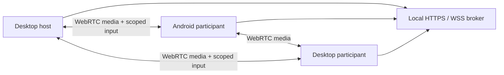

# Architecture

One desktop hosts a temporary HTTPS/WSS coordinator with an ephemeral certificate, room key and independent loopback-only host token. Invitation fragments carry the room key and certificate fingerprint. Native clients check the pin before admission. The broker assigns live peer IDs and permits signaling only after owner approval.

The four-person mesh uses perfect negotiation and distinct camera/presentation tracks. Bounded ordered data channels carry structured input. Electron checks IPC against its sandboxed bundled main frame; Windows uses SendInput and Mac a Swift/CoreGraphics helper. Grants scope a full display, peer and session and validate event types, sequence, rate and expiry. Revocation clears authorization before releasing keys.

Android uses bundled WebView assets and certificate-pinned Java WSS. A visible MediaProjection foreground service captures after system consent. One JPEG frame at a time feeds a canvas capture stream; acknowledgments bound work and memory. Accessibility maps approved events into gestures/navigation/editable text and cannot override secure surfaces. Ordinary backgrounding stops the room; explicitly active projection permits continuation with local/system stop.

No hosted backend, directory, relay, recording or billing integration is included. Optional user-configured STUN discovers candidates and does not relay traffic. Preferences stay local; room state is transient.
