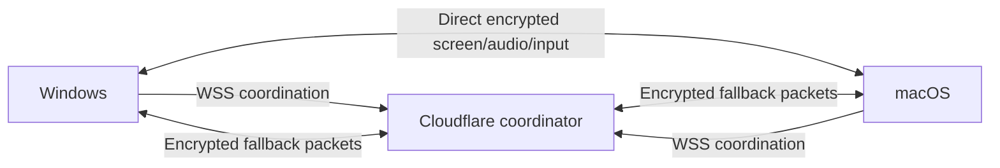

# Architecture

The 0.4 desktop milestone focuses on screen presentation, optional microphone audio and attended input. Its bundled interface runs in isolated Electron renderers. Camera capture/media slots are removed. Android source remains for later delivery.

## Invitation rooms

Desktop clients use normal CA/hostname-validated WSS to the supplied Cloudflare Worker. Cloudflare supplies the public workers.dev address. Guests need no domain, account or pairing form. A SQLite Durable Object holds bounded metadata and hibernatable sockets.

Bootstrap creates a short-lived connection-bound public identity without exposing private presence or replacing saved private credentials. Creation yields a room ID, 32-byte invitation capability and independent owner token. The A1 code/link encodes the capability; URL fragments stay out of HTTP requests. The landing page validates it before offering the installed-app link/copy fallback.

Invitation holders enter automatically while invitations are open. Server-assigned identities and ready/admitted membership govern signaling/media. The four-person cap includes the host. Pending/unrelated/removed sockets cannot receive media or forge senders. Owners remove guests, burn/rotate invitations or block the current connection and burn its invitation. This does not identify future anonymous apps permanently.

Bootstrap/creation/command limits, room lifetime and global caps persist. Source throttles retain keyed hashes, not raw addresses. Host loss ends its room and consent bindings. Finite budgets bound free infrastructure use.

## Media paths

A four-person direct mesh uses perfect negotiation and distinct **audio + screen** transceivers. Source replacement preserves slots. Screens are video tracks: removing camera calls does not remove encoder/bandwidth requirements. Desktop capture targets ceilings up to 2560×1440 at 30 fps; diagnostics show actual received dimensions, frame rate, codec and route.

When RTC fails and the service enables fallback, peers exchange authenticated AES-GCM envelopes over WSS. Direction/identity/epoch key derivation, counters and retired epochs reject tampering/replay. Queues, payloads and decoder dimensions are bounded. Teardown cancels work and disposes sources/decoders/generated tracks/audio contexts. JPEG is a low-frame-rate compatibility mode; encoded high-quality screens are tested separately. Microphone PCM uses AudioWorklets; playback restrictions appear as **Enable sound**.

Only exact encrypted relay envelopes get the larger 256 KiB ceiling; normal commands remain at 64 KiB. The coordinator verifies ready same-room membership, rewrites senders and reserves persistent allowances before forwarding. Current limits: 512 MiB/30 minutes per room, 1 GiB/300000 forwarded packets per day, plus a sender burst limit. Bounded byte/packet credits avoid a SQLite write for every frame; credits are never refunded. Attachment/persistence rules prevent healthy hibernation from reusing depleted credits. See [service budgets](../internet-service/README.md). Media payloads are not stored. The coordinator distributes relay keys, so this assumes a trusted coordinator.

Exhaustion visibly stops fallback without requiring unrelated direct peers to disconnect. TURN remains optional/disabled until provider free quota and expiry are verified; issuance counters alone are not a provider billing cap.

## Attended input

Bounded RTC channels or authenticated fallback carry structured input. Each screen owner grants control independently of admission, authorizing a full display and native permission before confirming a fresh session. IPC is restricted to the bundled sandboxed main frame. Windows uses SendInput; macOS uses Swift/CoreGraphics with Accessibility permission.

Input requires matching peer/session, active full-display share, increasing sequence, bounded rate and unexpired consent. The 15-minute coordinator lease binds device/peer/socket/room; hibernation retains only verified unexpired consent. Revocation clears authorization before releasing pressed keys. Socket replacement, capture stop, expiry or participant loss invalidates grants. Unattended/protected-surface access is outside scope.

## Advanced modes and lifecycle

Nearby hosts temporary HTTPS/WSS with an ephemeral certificate, room capability and owner token. Native clients pin invitation fingerprints. It retains admission review and usually needs a reachable private network.

Private Internet groups optionally pair up to 32 devices with hashed credentials and group-only presence. Their rooms retain owner approval. Forget invalidates tokens; default public invitations do not expose the directory or overwrite credentials.

Desktop minimization does not deliberately throttle media. OS permissions stay authoritative; CI cannot grant TCC or prove physical MacBook input. Deferred Android uses bundled WebView, native WSS and consented MediaProjection/generated frames. Its owner-visible session service retains ordinary background continuity; true renderer/service/socket loss ends the session rather than silently reacquiring capture/control. Physical vendor battery/routing/rotation tests remain necessary.

Policies, workerd/browser/Electron media, package parity and hardware tests establish different facts. The release report and [validation](../VALIDATION.md) distinguish them. Compilation does not establish universal connectivity, absolute security or unlimited free capacity.
